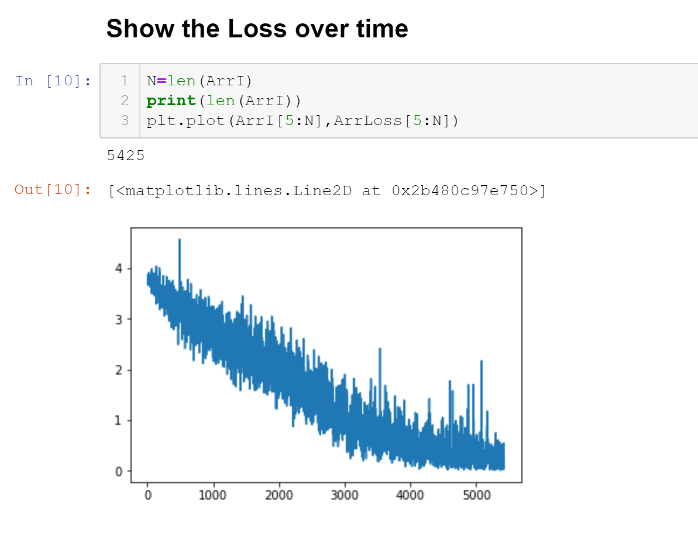
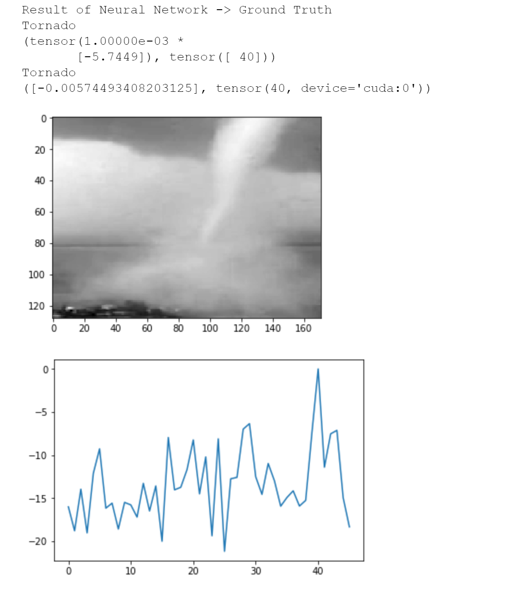

# Classic Neural Network VS C3D Identification Dynamic Texture

In this project Dynamic Texture is identified with two different methods: Classic Neural Networks and C3D (Convolutional Neural Network 3D) - Originally developed 04/09/2019

## What was developed in this project
Dynamic Texture is basically the texture that is created on a video from the dynamic movement of objects. The goal of this project is to create an identifier using Neural Networks that can find the type of Dynamic Texture in each video.

# Check Jupyter Notebook above

## Results of the Project 

## Technology Used 
1. PyTorch
2. Classic Neural Networks
3. C3D (Convolutional Neural Networks 3D)
4. Dynamic Texture
